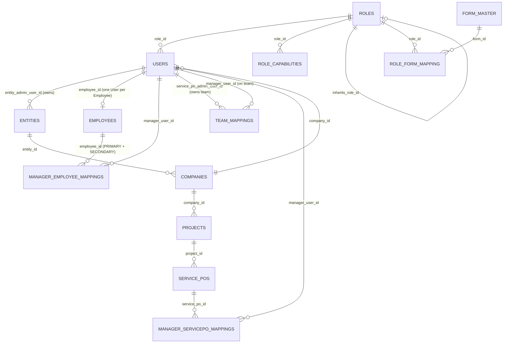

# RBAC Redesign — Architecture

## 1. Overview

The RBAC system was redesigned from a flat, half-migrated role list into a
strict 9-role hierarchy with a reusable, data-driven permission-inheritance
engine. Backward compatibility was explicitly not required — this is a
replacement, not a patch. The work shipped in four stages:

1. **DB schema & migrations** — new hierarchy columns, capability table,
   legacy-role remap, dual-role-storage collapse, Employee login columns
   removed, manager-mapping schema changes, Form Master reseed.
2. **Auth/login unification & capability engine** — single identity table
   for every account tier, one capability resolver, `authorize()` rewritten.
3. **Employee/User sync + manager mapping flows** — Employee creation
   auto-provisions a linked User, Primary/Secondary Manager assignment,
   Service PO Admin's Team Mapping.
4. **Remaining controllers/routes + `ROLE_CREATION_MATRIX`** — Admin tier,
   Entity/BU Admin regating, declarative role-creation rules.

## 2. Role Hierarchy

```
Platform Admin (rank 1)
      |
    Admin (rank 2)
      |
Entity Admin (rank 3)
      |
  BU Admin (rank 4)
      |
Project Admin (rank 5)  ---inherits--->  Service PO Admin (rank 6)  ---inherits--->  Manager (rank 7)
      |
  Employee (rank 8)

HR (rank NULL — parallel branch, not part of the numeric chain)
```

- `roles.hierarchy_rank`: 1 (Platform Admin) through 8 (Employee). `NULL`
  for HR, which sits outside the admin chain entirely.
- Only **two** inheritance edges exist, matching the spec's literal text
  ("Service PO Admin inherits every permission available to Manager",
  "Project Admin inherits every permission available to Service PO Admin").
  No inheritance is invented for BU Admin, Entity Admin, Admin, or Platform
  Admin — each of those has a fully self-contained capability list per its
  own "ROLE RESPONSIBILITIES" section in the spec.
- **Senior-tier bypass**: roles with `hierarchy_rank <= 4` (Platform
  Admin/Admin/Entity Admin/BU Admin) bypass `authorize()`'s capability
  check entirely — they manage everything within their own scope. This
  generalizes the old hardcoded `SUPERUSER_ROLES = ['super admin', 'bu
  admin']` bypass to the full new hierarchy, driven by rank instead of a
  role-name list.
- This bypass is **deliberately not applied** to `ROLE_CREATION_MATRIX`
  (see §5) — role-creation rights are a hard business rule, not a generic
  permission, and Platform Admin must never be able to create an Entity
  Admin or BU Admin directly even though it outranks them.

## 3. Permission Inheritance Engine

**Two tables, one resolver — no duplicated logic anywhere else in the app.**

- `roles.inherits_role_id` (self-referencing FK) — "this role's users also
  get every capability granted to the referenced role," walked
  transitively.
- `role_capabilities` (`role_id`, `capability_key`) — a role's **own**
  directly-granted capabilities only. An inherited capability is never
  copied into this table for the inheriting role.
- `src/services/roleHierarchyService.js`:
  - `getEffectiveCapabilities(roleId)` — walks the `inherits_role_id`
    chain, unioning `role_capabilities` at each hop, cycle-safe.
  - `hasCapability(effectiveSet, key)` — membership check (accepts one key
    or several, OR semantics).
  - `isSeniorTier(role)` — the rank ≤ 4 bypass check.

This single resolver replaced every previous ad hoc role-name check:
`authorize.js`'s `SUPERUSER_ROLES` array, `requireEntityAdmin.js`'s
hardcoded string, `users.is_platform_admin` boolean, and
`userService.js`'s `BU_ADMIN_CREATABLE_ROLES` array.

### Capability keys (seeded in `20260836_seed_target_roles_and_capabilities.sql`)

| Role | Own capabilities |
|---|---|
| Platform Admin | `platform.create_admin`, `platform.manage_role_master`, `platform.manage_form_master`, `platform.manage_platform` |
| Admin | `admin.create_entity_admin`, `admin.create_bu_admin`, `admin.view_entity_admins`, `admin.view_bu_admins`, `admin.manage_entity_admins`, `admin.manage_bu_admins` |
| Entity Admin | `entity.view_bu_admins`, `entity.create_bu_admin`, `entity.view_mapped_employees`, `entity.approve_timesheets` |
| BU Admin | `bu.manage_projects`, `bu.create_client`, `bu.create_project_admin`, `bu.create_servicepo_admin`, `bu.view_mapped_employees`, `bu.approve_timesheets` |
| Project Admin | `project.manage_servicepos`, `project.create_servicepo_admin`, `project.view_mapped_employees`, `project.approve_timesheets` **+ inherits Service PO Admin** |
| Service PO Admin | `servicepo.manage_team`, `servicepo.manage_team_mapping`, `servicepo.manage_future_budget`, `servicepo.view_mapped_employees`, `servicepo.approve_timesheets` **+ inherits Manager** |
| Manager | `manager.view_mapped_employees`, `manager.map_employees`, `manager.map_servicepos`, `manager.approve_timesheets` |
| Employee | `employee.view_timesheet`, `employee.fill_worklog`, `employee.view_reports` |
| HR | `hr.create_employee`, `hr.manage_employee`, `hr.manage_employee_timesheets` |

`authorize('capability.key')` in route files replaced role-name arrays
(`authorize(['Manager'])` → `authorize('manager.view_mapped_employees')`)
everywhere except two route files intentionally left on the old contract
— see [TESTING_SUMMARY.md](./TESTING_SUMMARY.md) for why.

## 4. Form Master (UI visibility) — separate from the capability engine

Form-visibility is **not inherited** — every role's form list in the spec's
"FORM MASTER" section is already fully self-contained, so `role_form_mapping`
is seeded verbatim per role (see `20260845_reseed_form_master_and_role_form_mapping.sql`).

**Platform Admin's "All Forms"** is an implicit bypass in
`rbacService.getActiveFormsForRoles(roleIds, hierarchyRank)` —
`hierarchyRank === 1` returns every active form directly from
`form_master`, not stored mapping rows. This means a newly-added form is
visible to Platform Admin immediately, with no reseed ever required.

## 5. Role Creation Matrix

`src/config/roleHierarchy.js` — the single source of truth for "who may
create a user holding role X":

```
Platform Admin    → [Admin]
Admin             → [Entity Admin, BU Admin]
Entity Admin      → [BU Admin]
BU Admin          → [Project Admin, Service PO Admin]
Project Admin     → [Service PO Admin]
Service PO Admin  → [Manager]
```

Enforced in `userService.js`'s `assertActorCanAssignRoles()`, called from
both `create()` and `update()` (role reassignment). A role that is not a
matrix key (HR, Manager, Employee, or no role) has **no** creation rights
via this generic path — HR creates Employees through the dedicated
`employeeService.create()` flow instead (see §7).

This is a **hard business rule**, deliberately not subject to the
senior-tier bypass (§2) — Platform Admin cannot shortcut past Admin to
create an Entity Admin directly, per the spec's explicit instruction.

## 6. Authentication & Login Flow

**One identity table for every account tier, including Employees.**

- `POST /auth/login` looks up `users` only (`authRepository.findUserByEmail`).
  There is no dual User/Employee lookup, no `loginType` field, no separate
  Employee JWT audience — those all existed pre-redesign and are removed.
- JWT payload: `{ id, email, roleId, roleName, hierarchyRank, employeeId }`.
- **Login response always returns both `user` and `employee`**:
  ```json
  { "user": { ... }, "employee": { ... } | null, "roles": [...], "forms": {...} }
  ```
  `employee` is `null` for any account with no linked Employee record
  (every Admin/Manager-tier user that isn't also staff).
- `authenticate` middleware (`src/middlewares/auth.js`) loads the user with
  their single `role` (no more `roles` many-to-many), computes
  `req.capabilities` via `roleHierarchyService.getEffectiveCapabilities()`
  once per request, and attaches `req.hierarchyRank` / `req.userRoleName`.
  `req.userRoles` / `req.userRole` / `req.activeRoles` are kept as
  arrays-of-one for backward compatibility with older call sites that
  haven't been touched.
- `resolveCompany` skips company-header validation for `hierarchyRank`
  1 (Platform Admin), 2 (Admin), and 3 (Entity Admin) — none of these
  tiers have a single company; Entity Admin is scoped to a **set** of
  Entities via `req.entityIds` instead (populated by
  `requireEntityAdmin.js` / `requireEntityAdminOrAdmin.js`).
- Removed entirely: `employeeAuth.js`, `dualAuth.js`,
  `loginTypeResolver.js`, the `EmployeeSession`/`UserRole` models, and
  every Employee-specific JWT function in `config/jwt.js`.

### Password reset (forgot-password/OTP)

Simplified to User-only (`forgotPasswordService.js`). The
`password_reset_otps`/`password_reset_history` tables still carry a
`login_type` column from when both account types existed — every row this
service writes now just passes the literal `'user'`, leaving that schema
untouched rather than migrating it (it's an OTP-stream partition key, not
a business concept worth reintroducing).

## 7. Employee Creation Flow

`employeeService.create()` — one transaction:

1. Create the `Employee` row (business data only — no `password`, no
   `email_id`; both columns were dropped).
2. Create a linked `User` row: `role_id` = Employee role, `employee_id` =
   the new Employee's id, same `company_id`. Password: caller-supplied, or
   a randomly generated 16-character policy-compliant password returned
   **once** in the response as `temporaryPassword` (never persisted in
   plaintext, never retrievable again).
3. Create a mandatory `manager_employee_mappings` row,
   `mapping_type = 'PRIMARY'`.
4. Optionally create a second row, `mapping_type = 'SECONDARY'`.

Both managers are validated: same `company_id` as the Employee, active,
and their role's effective capabilities include
`manager.view_mapped_employees` (covers Manager, and — via inheritance —
Service PO Admin and Project Admin too, reusing the same resolver rather
than a second hardcoded role-name check).

Gated by `authorize('hr.create_employee')`.

Resetting an Employee's login password is now a User Master operation
(`PUT /users/:id`) — there is no dedicated Employee reset-password
endpoint anymore, since Employee carries no password of its own.

## 8. Manager Mapping Flows

Three distinct mechanisms, each with a clear owner:

| Mechanism | Owner | Table | Notes |
|---|---|---|---|
| Primary/Secondary Manager | HR (at Employee creation) | `manager_employee_mappings` | `mapping_type` ENUM('PRIMARY','SECONDARY'), unique per `(employee_id, mapping_type)` |
| Manager's own "Map Employees" | Manager (self-service) | `manager_employee_mappings` | Claims/releases the SECONDARY slot only — `POST/DELETE /my-team/employees` |
| Manager's own "Map Service POs" | Manager (self-service) | `employee_servicepo_mapping` (existing, unmodified) | Assigns a PO already granted to the Manager onto one of their own Employees |
| Team roster ("Manage Team") | Service PO Admin (self-service) | `team_mappings` (renamed from `head_manager_mappings`) | Which Managers are on my team — `GET/POST/DELETE /team-mappings` |
| Team PO grants ("Manage Team Mapping") | Service PO Admin (self-service) | `manager_servicepo_mappings` (existing, unmodified) | Which Service POs my team's Managers can operate on |

The old **Head Manager** role and its BU-Admin-assigns-on-someone's-behalf
delegation model (`headManagerMappingController`/`managerDelegationController`,
`managerMapping.routes.js`) are fully retired — Service PO Admin now
manages its own team directly (self-service), one hierarchy hop shorter.

## 9. Database Changes Summary

See [MIGRATIONS_AND_SEEDING.md](./MIGRATIONS_AND_SEEDING.md) for the full
migration-by-migration breakdown. Headline schema changes:

- `roles`: `+hierarchy_rank`, `+inherits_role_id`, `+is_system`.
- `role_capabilities`: new table (capability grants).
- `role_migration_log`: new table (audit trail for the legacy-role remap).
- `users`: `-is_platform_admin` (superseded by `hierarchy_rank = 1`);
  `+` partial unique index on `employee_id` (one User per Employee);
  dropped a stray `DEFAULT 1` on `company_id` (see
  [TESTING_SUMMARY.md](./TESTING_SUMMARY.md)).
- `employees`: `-password`, `-email_id` (Employee is pure business data now).
- `employee_sessions`, `user_roles`: dropped entirely.
- `manager_employee_mappings`: `+mapping_type`, unique constraint widened
  to `(employee_id, mapping_type)`.
- `head_manager_mappings` → renamed to `team_mappings`,
  `head_manager_user_id` → `service_po_admin_user_id`.
- `form_master` / `role_form_mapping`: 14 new forms, full reseed to match
  the spec's per-role list exactly.

## 10. ER Diagram (identity/org-hierarchy subset)



Key relationships not obvious from the diagram:

- **User ↔ Role is 1:1** (`users.role_id`) — the old `user_roles`
  many-to-many table is gone. A user's role is never ambiguous.
- **User ↔ Employee is 0/1:0/1** — a User need not have an Employee
  (every Admin/Manager tier); an Employee always has exactly one User
  (auto-created); a partial unique index prevents a second User ever
  attaching to the same Employee.
- **Entity Admin/Admin/Platform Admin have `company_id = NULL`** by design
  — they're not scoped to one company. Entity Admin's scope is a
  *computed set* (`entities.entity_admin_user_id = user.id`), not a
  stored column.
- **`team_mappings` and `manager_servicepo_mappings` are structurally
  independent** — a Manager's team membership and their Service PO grants
  are two separate facts, both owned by the same Service PO Admin, but
  not a single normalized structure (matches the spec's two distinct
  capabilities, `servicepo.manage_team` vs `servicepo.manage_team_mapping`).
